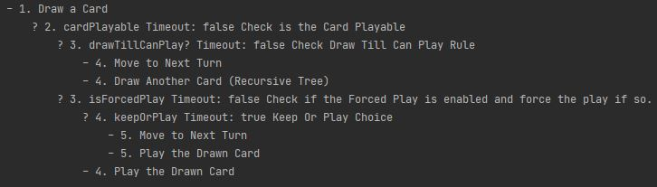
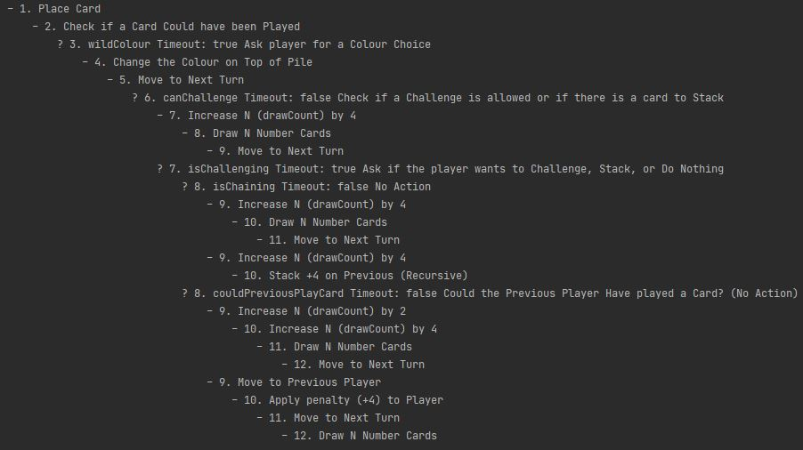

# Turn Action Documentation

Written by Peter Mitchell

This content covers briefly a walkthrough to explain the process used for managing the sequence of play for turns in my Uno game. For the full code and comments to fully explain every part of the code see the links to the files for each code block.

## Contents

<p><ul>
	<li><a href="#examples-of-turnaction-sequences">Examples of TurnAction Sequences</a></li>
	<li><a href="#turn-actions">Turn Actions</a></li>
	<li><a href="#turn-action-decisions">Turn Action Decisions</a></li>
	<li><a href="#turn-action-sequence">Turn Action Sequence</a></li>
	<li><a href="#turn-action-sequence-manager">Turn Action Sequence Manager</a></li>
	<li><a href="#turn-action-factory">Turn Action Factory</a></li>
	<li><a href="#how-the-ai-uses-the-turnactions">How the AI uses the TurnActions</a></li>
</ul></p>

## Examples of TurnAction Sequences

The following graphics show debug output examples of two cases for TurnAction Sequences. Each numbered item is a separate TurnAction. Where the number denotes the order in which statements would execute. Any statement preceeded by a "-" is a TurnAction, and any preceeded by a "?" is a TurnDecisionAction. Each TurnDecisionAction has up to 2 paths that are determined with a binary 0 or 1 stored in a map shared by each sequence.

### Drawing a card



### Playing a Draw 4 Card



## Turn Actions

Turn actions represent a linked list that stores a TurnActionEffect, reference to the next element, and provides methods for property injection to a shared map for that specific sequence, and a method to get a reference to the next element (that may be null).

[Turn Action Class Direct Link](https://github.com/Squirrelbear/Uno-CPP/blob/38a99d8dcc85361f9bbbb771789b0cc10d519d21/Uno-CPP/Uno-CPP/TurnAction.h#L17)
```c++
class TurnAction
{
public:
	TurnAction(TurnAction* next, TurnActionSequence<TurnAction>* parentSequence, const TurnActionEffect actionID, const std::string& actionDebugText);
	virtual ~TurnAction() = default;

	virtual TurnActionEffect getTurnAction();
	virtual TurnAction* getNext();
	void injectProperty(const std::string& key, const int value);
	int getPropertyValue(const std::string& key) const;
	
    std::string getActionDebugText() const;
	TurnAction* getNextPointer() const;

protected:
	TurnActionSequence<TurnAction>* _parent;
	const TurnActionEffect _actionID;
	TurnAction* _next;
	std::string _actionDebugText;
};
```

For this basic case, the intent is for a TurnAction to provide its TurnActionEffect and iterate to the next element. Property injection exposes the shared map for a single sequence that is stored by a parent sequence.

[Turn Action Class Method Implementation Link](https://github.com/Squirrelbear/Uno-CPP/blob/main/Uno-CPP/Uno-CPP/TurnAction.cpp)
```c++
TurnAction * TurnAction::getNext()
{
	return _next;
}

void TurnAction::injectProperty(const std::string & key, const int value)
{
	_parent->injectProperty(key, value);
}

int TurnAction::getPropertyValue(const std::string & key) const
{
	return _parent->getPropertyValue(key);
}
```

Effects include the below definitions, which emcompass all the different types of effects.

[Turn Action Effect Enum Direct Link](https://github.com/Squirrelbear/Uno-CPP/blob/38a99d8dcc85361f9bbbb771789b0cc10d519d21/Uno-CPP/Uno-CPP/TurnActionEffect.h#L12)
```c++
enum TurnActionEffect { 
    Nothing, DrawCard, PlaceCard, MoveNextTurn, IncreaseDrawCountBy2, IncreaseDrawCountBy4, 	
    DrawNCards, IsCardPlayable, BeginChoiceOverlay, CheckDrawTillCanPlayRule, 	
    HasPlus2AndResponseAllowed, ShowSkip, TogglePlayDirection, SetTopPileColour, 
    CheckCouldPlayCard, Draw4ChallengeSuccess, MovePrevious, SwapHandWithOther, PassAllHands, 
    ShowChallengeResult, CheckNoBluffingRule, CheckForcedPlayRule, PlayCardAsActionFromData, 
    DrawCardAsActionFromData
};
```

## Turn Action Decisions

TurnActionDecision objects extend from the TurnAction to provide enhanced functionality. The primary difference is that the getNext() function is configured to return the current object unless a pre-condition has been met. This is referred to as the "FlagProperty".

[Turn Decision Action Class Direct Link](https://github.com/Squirrelbear/Uno-CPP/blob/main/Uno-CPP/Uno-CPP/TurnDecisionAction.h)
```c++
class TurnDecisionAction :
	public TurnAction
{
public:
	TurnDecisionAction(TurnAction* next, TurnAction* otherNext, const bool timeOut, const std::string& flagName, 
    TurnActionSequence<TurnAction>* parentSequence, const TurnActionEffect actionID, const std::string& actionDebugText);
	virtual ~TurnDecisionAction() = default;

	TurnAction* getNext() override;
	TurnActionEffect getTurnAction() override;
	void injectFlagProperty(const int value);

	bool requiresTimeout() const;
	std::string getFlagName() const;
	bool getHasRunOnce() const;
	bool getTimeOut() const;
	TurnAction* getOtherNextPointer() const;

private:
	bool _timeOut;
	TurnAction* _otherNext;
	std::string _flagName;
	bool _hasRunOnce;
};
```

The use of the flag property as a _flagName can be seen below where the method only returns a reference to a different object after the flag has been set to a value. The object returned is determined based on a true/false value where a 0 returns the _next value, or _otherNext for any other value.

[Turn Decision Action Class Implementation Direct Link](https://github.com/Squirrelbear/Uno-CPP/blob/main/Uno-CPP/Uno-CPP/TurnDecisionAction.cpp)

```c++
TurnAction * TurnDecisionAction::getNext()
{
	if(getPropertyValue(_flagName) != -1) {
        return (getPropertyValue(_flagName) == 0) ? _next : _otherNext;
    }
    return this;
}
```

Due to the TurnDecisionAction staying present as the current object for an extended period of time, they are configured to only apply their effect once. This single execution is shown below.

```c++
TurnActionEffect TurnDecisionAction::getTurnAction()
{
	if (_hasRunOnce) { return TurnActionEffect::Nothing; }
	_hasRunOnce = true;
	// Call the base version to actually perform the action.
	return TurnAction::getTurnAction();
}
```

## Turn Action Sequence

TurnActionSequence objects are constructed with sequences made up of the TurnAction and TurnDecisionAction objects together. This class satisfies the requirement to manage all references to the sequence while still maintaining the current TurnAction. The sequence's TurnActions are only disposed all together at the end because the sequences can share common nodes.

The resolveEffect(TurnActionEffect) method maps TurnActionEffect enums to their method counterparts. The iterateSequence() method gets the action for the current node and then moves to the next node. Most of the methods utilise the map for providing data accessible to the sequence's effects.


[Turn Action Sequence Class Direct Link](https://github.com/Squirrelbear/Uno-CPP/blob/main/Uno-CPP/Uno-CPP/TurnActionSequence.h)
```c++
template <class T>
class TurnActionSequence
{
public:
	explicit TurnActionSequence();
	virtual ~TurnActionSequence();

	void setStartOfSequence(T* startAction);
	void iterateSequence();
	T* getCurrentAction();
	void injectProperty(const std::string& key, const int value);
	int getPropertyValue(const std::string& key) const;
	RuleSet* getRuleSet();
	void debugOutputTurnActionTree();

private:
	std::vector<T*> _unorderedSequence;
	T* _currentAction;
	std::map<std::string, int> _storedData;
	RuleSet* _ruleSet;

	// Uses the enum to determine which method should be called based on the effect.
	void resolveEffect(TurnActionEffect effect);

    // Effect methods
	void playCardAsActionFromData();
	void drawCardAsActionFromData();
	void drawCard();
	void placeCard();
	void moveNextTurn();
	void increaseDrawCountBy2();
	void increaseDrawCountBy4();
	void increaseDrawCountByN(const int N);
	void drawNCards();
	void isCardPlayable();
	void beginChoiceOverlay();
	void checkDrawTillCanPlayRule();
	void hasPlus2AndResponseAllowed();
	void showSkip();
	void togglePlayDirection();
	void setTopPileColour();
	void checkCouldPlayCard();
	void draw4ChallengeSuccess();
	void movePrevious();
	void swapHandWithOther();
	void passAllHands();
	void showChallengeResult();
	void checkNoBluffingRule();
	void checkForcedPlayRule();
	void flushTurnActions();

    // Sequence evaluation
	void loadAllPointers(T* actionToAdd);
};

```

[Turn Action Sequence Implementation Direct Link](https://github.com/Squirrelbear/Uno-CPP/blob/main/Uno-CPP/Uno-CPP/TurnActionSequence.cpp)
```c++
void TurnActionSequence<TurnAction>::setStartOfSequence(TurnAction * startAction)
{
	// This should not happen, but if the method has been previously called force the sequence to dump everything.
	if (!_unorderedSequence.empty()) {
		flushTurnActions();
	}

	// Set the currentAction to the start and parse the tree to find all pointers for ownership
	_currentAction = startAction;
	loadAllPointers(_currentAction);
}

void TurnActionSequence<TurnAction>::iterateSequence()
{
	TurnActionEffect effect = _currentAction->getTurnAction();
	resolveEffect(effect);
	_currentAction = _currentAction->getNext();
}

template<class T>
void TurnActionSequence<T>::resolveEffect(TurnActionEffect effect)
{
	switch (effect) {
		case TurnActionEffect::BeginChoiceOverlay:
			beginChoiceOverlay();
			break;
		case TurnActionEffect::CheckCouldPlayCard:
			checkCouldPlayCard();
			break;
		case TurnActionEffect::CheckDrawTillCanPlayRule:
			checkDrawTillCanPlayRule();
			break;
		case TurnActionEffect::CheckForcedPlayRule:
			checkForcedPlayRule();
			break;
		case TurnActionEffect::CheckNoBluffingRule:
			checkNoBluffingRule();
			break;
		case TurnActionEffect::Draw4ChallengeSuccess:
			draw4ChallengeSuccess();
			break;
		case TurnActionEffect::DrawCard:
			drawCard();
			break;
		case TurnActionEffect::DrawCardAsActionFromData:
			drawCardAsActionFromData();
			break;
		case TurnActionEffect::DrawNCards:
			drawNCards();
			break;
		case TurnActionEffect::HasPlus2AndResponseAllowed:
			hasPlus2AndResponseAllowed();
			break;
		case TurnActionEffect::IncreaseDrawCountBy2:
			increaseDrawCountBy2();
			break;
		case TurnActionEffect::IncreaseDrawCountBy4:
			increaseDrawCountBy4();
			break;
		case TurnActionEffect::IsCardPlayable:
			isCardPlayable();
			break;
		case TurnActionEffect::MoveNextTurn:
			moveNextTurn();
			break;
		case TurnActionEffect::MovePrevious:
			movePrevious();
			break;
		case TurnActionEffect::PassAllHands:
			passAllHands();
			break;
		case TurnActionEffect::PlaceCard:
			placeCard();
			break;
		case TurnActionEffect::PlayCardAsActionFromData:
			playCardAsActionFromData();
			break;
		case TurnActionEffect::SetTopPileColour:
			setTopPileColour();
			break;
		case TurnActionEffect::ShowChallengeResult:
			showChallengeResult();
			break;
		case TurnActionEffect::ShowSkip:
			showSkip();
			break;
		case TurnActionEffect::SwapHandWithOther:
			swapHandWithOther();
			break;
		case TurnActionEffect::TogglePlayDirection:
			togglePlayDirection();
			break;
		case TurnActionEffect::Nothing:
			// Do nothing...
			break;
		default:
			std::cerr << "ERROR! Unknown TurnActionEffect missing function definition." << std::endl;
			break;
	}
}
```

Examples of some effect methods.

```c++
template<class T>
void TurnActionSequence<T>::drawCard()
{
	// Draw card from deck
	Deck* deck = Game::getCurrentGame()->getDeck();
	Card* drawnCard = deck->drawCard();
	// store ID into storedData
	injectProperty("cardID", drawnCard->getUniqueCardID());
	injectProperty("faceValueID", drawnCard->getFaceValueID());
	injectProperty("colourID", drawnCard->getColourID());
	// Add card to hand
	Game::getCurrentGame()->getCurrentPlayer()->addCardToHand(drawnCard);
}

template<class T>
void TurnActionSequence<T>::checkDrawTillCanPlayRule()
{
	injectProperty("drawTillCanPlay?", _ruleSet->shouldDrawnTillCanPlay() ? 1 : 0);
}

// Queues up a new sequence based on the faceValueID of the played card.
template<class T>
void TurnActionSequence<T>::playCardAsActionFromData()
{
	TurnActionSequence<TurnAction>* playCard = TurnActionFactory::playCardAsAction(
        getPropertyValue("playerID"), getPropertyValue("cardID"),
		getPropertyValue("faceValueID"), getPropertyValue("colourID"));
	playCard->injectProperty("drawCount", getPropertyValue("drawCount"));
	Game::getCurrentGame()->setCurrentTurnAction(playCard);
}
```

## Turn Action Sequence Manager

The TurnActionSequenceManager class is responsible for managing the state of the current TurnActionSequence that is active, and handle the transition to a queued TurnActionSequence. tHE Transition can occur based on calls from playCardAsActionFromData() as seen above, or the equivalent for drawing.

[Turn Action Sequence Manager Class Direct Link](https://github.com/Squirrelbear/Uno-CPP/blob/main/Uno-CPP/Uno-CPP/TurnActionSequenceManager.h)
```c++
class TurnActionSequenceManager
{
public:
	explicit TurnActionSequenceManager(const bool& debugModeEnabled);
	virtual ~TurnActionSequenceManager();
	
    void update();
	void setSequence(TurnActionSequence<TurnAction>* newSequence);
	void queueSequence(TurnActionSequence<TurnAction>* newSequence);

	TurnAction* getCurrentTurnAction() const;
	bool hasActiveTurnAction() const;

	// [DEBUG ONLY] 
	void toggleDebugShowTaskActionNotes();
	void toggleDebugShowTreeOnNewAction();

private:
	TurnActionSequence<TurnAction>* _currentSequence;
	TurnActionSequence<TurnAction>* _queuedSequence;
	const bool& _debugModeEnabled;
	bool _debugShowTaskActionNotes;
	bool _debugShowTreeOnNewAction;
};
```

The below shows the most important parts of the class management with handling of transitions between queued and current sequences. 

[Turn Action Sequence Manager Implementation Direct Link](https://github.com/Squirrelbear/Uno-CPP/blob/main/Uno-CPP/Uno-CPP/TurnActionSequenceManager.cpp)
```c++
void TurnActionSequenceManager::update()
{
	if (hasActiveTurnAction()) {
		// Tree Debug Output
		if (_debugModeEnabled && _debugShowTaskActionNotes) {
			TurnDecisionAction* decisionAction = dynamic_cast<TurnDecisionAction*>(getCurrentTurnAction());
			if (decisionAction != nullptr) {
				if (!decisionAction->getHasRunOnce()) {
					std::cout << getCurrentTurnAction()->getActionDebugText() << std::endl;
				}
			}
			else {
				std::cout << getCurrentTurnAction()->getActionDebugText() << std::endl;
			}
		}
		_currentSequence->iterateSequence();

		// Force swap to queued sequence if there is one
		if (_queuedSequence != nullptr) {
			delete _currentSequence;
			_currentSequence = _queuedSequence;
			_queuedSequence = nullptr;
		}
		// If the sequence ended delete the sequence
		else if (getCurrentTurnAction() == nullptr) {
			delete _currentSequence;
			_currentSequence = nullptr;
		}
	}
}

void TurnActionSequenceManager::setSequence(TurnActionSequence<TurnAction>* newSequence)
{
	if (hasActiveTurnAction()) {
		queueSequence(newSequence);

		if (_debugModeEnabled && _debugShowTreeOnNewAction) {
			std::cout << "Queued action sequence:" << std::endl;
			_currentSequence->debugOutputTurnActionTree();
		}
	}
	else {
		if (_currentSequence != nullptr) {
			delete _queuedSequence;
		}
		_currentSequence = newSequence;

		if (_debugModeEnabled && _debugShowTreeOnNewAction) {
			std::cout << "Set action sequence:" << std::endl;
			_currentSequence->debugOutputTurnActionTree();
		}
	}
}
```

## Turn Action Factory

The Turn Action Factory provides methods to generate a TurnActionSequence relevant to the current action for a faceValueID. Sequences can either be generated for the simple drawCardAsAction case, or the more varied playCardAsAction case.

[Turn Action Factory Class Direct Link](https://github.com/Squirrelbear/Uno-CPP/blob/main/Uno-CPP/Uno-CPP/TurnActionFactory.h)
```c++
static class TurnActionFactory
{
public:
	static TurnActionSequence<TurnAction>* playCardAsAction(const int playerID, const int cardID, 
    const int faceValueID, const int colourID);
	static TurnActionSequence<TurnAction>* drawCardAsAction(const int playerID);

private:
	static TurnAction* playPlus2Action(TurnActionSequence<TurnAction>* nextSequence);
	static TurnAction* playPlus4Action(TurnActionSequence<TurnAction>* nextSequence);
	static TurnAction* playWildAction(TurnActionSequence<TurnAction>* nextSequence);
	static TurnAction* playSkipAction(TurnActionSequence<TurnAction>* nextSequence);
	static TurnAction* playReverseAction(TurnActionSequence<TurnAction>* nextSequence);
	static TurnAction* playSwapAction(TurnActionSequence<TurnAction>* nextSequence);
	static TurnAction* playPassAllAction(TurnActionSequence<TurnAction>* nextSequence);
	static TurnAction* cardIDToTurnAction(const int faceValueID, TurnActionSequence<TurnAction>* nextSequence);
};
```

Some examples of the methods are seen below.

[Turn Action Factory Implementation Direct Link](https://github.com/Squirrelbear/Uno-CPP/blob/main/Uno-CPP/Uno-CPP/TurnActionFactory.cpp)
```c++
TurnActionSequence<TurnAction>* TurnActionFactory::playCardAsAction(const int playerID, const int cardID, 
const int faceValueID, const int colourID)
{
	TurnActionSequence<TurnAction>* nextSequence = new TurnActionSequence<TurnAction>();
	nextSequence->injectProperty("playerID", playerID);
	nextSequence->injectProperty("cardID", cardID);
	nextSequence->injectProperty("faceValueID", faceValueID);
	nextSequence->injectProperty("colourID", colourID);
	TurnAction* cardAction = cardIDToTurnAction(faceValueID, nextSequence);
	TurnAction* placeCardAction = new TurnAction(cardAction, nextSequence, TurnActionEffect::PlaceCard, "Place Card");

	// Link sequence in by setting the start.
	nextSequence->setStartOfSequence(placeCardAction);
	return nextSequence;
}

TurnActionSequence<TurnAction>* TurnActionFactory::drawCardAsAction(const int playerID)
{
	TurnActionSequence<TurnAction>* nextSequence = new TurnActionSequence<TurnAction>();
	nextSequence->injectProperty("playerID", playerID);
	TurnAction* moveToNextTurn = new TurnAction(nullptr, nextSequence, TurnActionEffect::MoveNextTurn, "Move to Next Turn");
	TurnAction* playCard = new TurnAction(nullptr, nextSequence, 
    	TurnActionEffect::PlayCardAsActionFromData, "Play the DrawnCard");
	TurnDecisionAction* keepOrPlay = new TurnDecisionAction(moveToNextTurn, playCard, true, "keepOrPlay", nextSequence, 
    	TurnActionEffect::BeginChoiceOverlay, "Keep Or Play Choice");
	TurnDecisionAction* isForcedPlay = new TurnDecisionAction(keepOrPlay, playCard, false, "isForcedPlay", nextSequence, 
    	TurnActionEffect::CheckForcedPlayRule, "Check if the Forced Play is enabled and force the play if so.");
	TurnAction* keepDrawing = new TurnAction(nullptr, nextSequence, 
    	TurnActionEffect::DrawCardAsActionFromData, "Draw Another Card (Recursive Tree)");
	TurnDecisionAction* drawTillCanPlay = new TurnDecisionAction(moveToNextTurn, keepDrawing, false, "drawTillCanPlay?", nextSequence, 
    	TurnActionEffect::CheckDrawTillCanPlayRule, "Check Draw Till Can Play Rule");
	TurnDecisionAction* canPlayCard = new TurnDecisionAction(drawTillCanPlay, isForcedPlay, false, "cardPlayable", nextSequence, 
    	TurnActionEffect::IsCardPlayable, "Check is the Card Playable");
	TurnAction* drawCard = new TurnAction(canPlayCard, nextSequence, 
    	TurnActionEffect::DrawCard, "Draw a Card");
	
	// Link sequence in by setting the start.
	nextSequence->setStartOfSequence(drawCard);
	return nextSequence;
}

TurnAction * TurnActionFactory::cardIDToTurnAction(const int faceValueID, TurnActionSequence<TurnAction>* nextSequence)
{
	switch (Game::getCurrentGame()->getRuleSet()->getActionForCard(faceValueID)) {
		case RuleSet::CardAction::Plus2: return playPlus2Action(nextSequence);
		case RuleSet::CardAction::Plus4: return playPlus4Action(nextSequence);
		case RuleSet::CardAction::Wild: return playWildAction(nextSequence);
		case RuleSet::CardAction::Skip: return playSkipAction(nextSequence);
		case RuleSet::CardAction::Reverse: return playReverseAction(nextSequence);
		case RuleSet::CardAction::Swap: return playSwapAction(nextSequence);
		case RuleSet::CardAction::PassAll: return playPassAllAction(nextSequence);
		default: return new TurnAction(nullptr, nextSequence, TurnActionEffect::MoveNextTurn, "Move to Next Turn");
	};
}

TurnAction * TurnActionFactory::playPlus4Action(TurnActionSequence<TurnAction>* nextSequence)
{
	TurnAction* moveToNextSkipDamagedPlayer = new TurnAction(nullptr, nextSequence, 
    	TurnActionEffect::MoveNextTurn, "Move to Next Turn");
	TurnAction* drawNCards = new TurnAction(moveToNextSkipDamagedPlayer, nextSequence, 
    	TurnActionEffect::DrawNCards, "Draw N Number Cards");
	TurnAction* increaseDrawBy4 = new TurnAction(drawNCards, nextSequence, 
    	TurnActionEffect::IncreaseDrawCountBy4, "Increase N (drawCount) by 4");
	TurnAction* playCardAsResponse = new TurnAction(nullptr, nextSequence, 
    	TurnActionEffect::PlayCardAsActionFromData, "Stack +4 on Previous (Recursive)");
	TurnAction* increaseDrawBy4ThenStack = new TurnAction(playCardAsResponse, nextSequence, 
    	TurnActionEffect::IncreaseDrawCountBy4, "Increase N (drawCount) by 4");
	TurnDecisionAction* isChainingCard = new TurnDecisionAction(increaseDrawBy4, increaseDrawBy4ThenStack,
		false, "isChaining", nextSequence, TurnActionEffect::Nothing, "No Action");
	TurnAction* drawNCardsAndDoNothing = new TurnAction(nullptr, nextSequence, 
    	TurnActionEffect::DrawNCards, "Draw N Number Cards");
	TurnAction* moveBackToNext = new TurnAction(drawNCardsAndDoNothing, nextSequence, 
    	TurnActionEffect::MoveNextTurn, "Move to Next Turn");
	TurnAction* applyPenalty = new TurnAction(moveBackToNext, nextSequence, 
    	TurnActionEffect::Draw4ChallengeSuccess, "Apply penalty (+4) to Player");
	TurnAction* moveToPreviousPlayer = new TurnAction(applyPenalty, nextSequence, 
    	TurnActionEffect::MovePrevious, "Move to Previous Player");
	TurnAction* increaseDrawBy2 = new TurnAction(increaseDrawBy4, nextSequence, 
    	TurnActionEffect::IncreaseDrawCountBy2, "Increase N (drawCount) by 2");
	TurnDecisionAction* couldPreviousPlayCard = new TurnDecisionAction(increaseDrawBy2, moveToPreviousPlayer,
		false, "couldPreviousPlayCard", nextSequence, TurnActionEffect::ShowChallengeResult, 
    	"Could the Previous Player Have played a Card? (No Action)");
	TurnDecisionAction* isChallenging = new TurnDecisionAction(isChainingCard, couldPreviousPlayCard, true,
		"isChallenging", nextSequence, TurnActionEffect::BeginChoiceOverlay, 
    	"Ask if the player wants to Challenge, Stack, or Do Nothing");
	TurnDecisionAction* canChallengeOrStack = new TurnDecisionAction(increaseDrawBy4, isChallenging, false,
		"canChallenge", nextSequence, TurnActionEffect::CheckNoBluffingRule, 
    	"Check if a Challenge is allowed or if there is a card to Stack");
	TurnAction* moveToNextTurn = new TurnAction(canChallengeOrStack, nextSequence, 
    	TurnActionEffect::MoveNextTurn, "Move to Next Turn");
	TurnAction* setTopOfPileColour = new TurnAction(moveToNextTurn, nextSequence, 
    	TurnActionEffect::SetTopPileColour, "Change the Colour on Top of Pile");
	TurnDecisionAction* chooseWildColour = new TurnDecisionAction(setTopOfPileColour, setTopOfPileColour,
		true, "wildColour", nextSequence, TurnActionEffect::BeginChoiceOverlay, 
    	"Ask player for a Colour Choice");
	return new TurnAction(chooseWildColour, nextSequence, 
    	TurnActionEffect::CheckCouldPlayCard, "Check if a Card Could have been Played");
}
```

## How the AI uses the TurnActions

The AI uses the current game state information to evaluate actions it is allowed to perform with a weighted chance to select each type of action.

[AI Player Implementation Direct Link](https://github.com/Squirrelbear/Uno-CPP/blob/main/Uno-CPP/Uno-CPP/AIPlayer.cpp)
```c++
PlayerUpdateResult AIPlayer::update(const float deltaTime, const Player* currentPlayer, TurnAction* currentTurnAction, const RecentCardPile* recentCards, const std::vector<Player*>& players, const RuleSet* rules)
{
	PlayerUpdateResult result = updateAntiUnoCheck(deltaTime, players);
	if (result.resultState != PlayerUpdateResultState::PlayerDidNothing) {
		return result;
	}
	result = updateJumpInCheck(deltaTime, rules, currentTurnAction, currentPlayer, recentCards);
	if (result.resultState != PlayerUpdateResultState::PlayerDidNothing) {
		return result;
	}

	// Do nothing more if this is not the current player.
	if (currentPlayer != this) {
		// Result will already contain PlayerDidNothing due to the checks above.
		return result;
	}

	// Delay until
	_delayTimer -= deltaTime;
	if (_delayTimer <= 0) {
		resetDelayTimer();
	}
	else {
		return { PlayerUpdateResultState::PlayerDidNothing, nullptr, -1, nullptr };
	}

	// If there is no turn action to deal with it means that the player is performing their regular turn
	if (currentTurnAction == nullptr) {
		Card* topCard = recentCards->getTopCard();
		auto action = performTurn(topCard);
		// Handle special case where the player needs to call UNO simultaneously with playing their card.
		PlayerUpdateResultState state = action.second.resultState == PlayerUpdateResultState::PlayerCalledUno ? PlayerUpdateResultState::PlayerStartedTurnActionWithUno : PlayerUpdateResultState::PlayerStartedTurnAction;
		return {state, action.first, action.second.playerIDForResult, nullptr };
	}
	else {
		// Handle the turn action if it is necessary
		TurnDecisionAction* decisionAction = dynamic_cast<TurnDecisionAction*>(currentTurnAction);
		if (decisionAction != nullptr) {
			if (decisionAction->getTimeOut()) {
				return handleTurnDecision(decisionAction, players, rules);
			}
		}
	}
	return { PlayerUpdateResultState::PlayerDidNothing, nullptr, -1, nullptr };
}

PlayerUpdateResult AIPlayer::handleTurnDecision(TurnDecisionAction * decisionAction, const std::vector<Player*>& players, const RuleSet* rules)
{
	if (decisionAction->getFlagName() == "wildColour") {
		return chooseWildColour(decisionAction);
	}
	else if (decisionAction->getFlagName() == "keepOrPlay") {
		return chooseKeepOrPlay(decisionAction);
	}
	else if (decisionAction->getFlagName() == "otherPlayer") {
		return choosePlayerToSwapWith(decisionAction, players);
	}
	else if (decisionAction->getFlagName() == "isChallenging") {
		return chooseChallengeOrDecline(decisionAction, rules);
	}
	else if (decisionAction->getFlagName() == "isStacking") {
		return chooseStackPlus2(decisionAction, rules);
	}

	return { PlayerUpdateResultState::PlayerDidNothing, nullptr, -1, nullptr };
}


PlayerUpdateResult AIPlayer::chooseWildColour(TurnDecisionAction * decisionAction)
{
	std::vector<Card*> colouredHandCards;
	for (auto card : getHand()) {
		if (card->getColourID() != 4) {
			colouredHandCards.emplace_back(card);
		}
	}

	// No cards, or only wilds, or rare 10% chance: randomly choose colour
	if (colouredHandCards.empty() || _randomEngine() % 100 > 90) {
		decisionAction->injectProperty("colourID", _randomEngine() % 4);
	}
	else { // Use first coloured card
		decisionAction->injectProperty("colourID", colouredHandCards.at(0)->getColourID());
	}
	decisionAction->injectFlagProperty(1);

	return { PlayerUpdateResultState::PlayerDidNothing, nullptr, -1, nullptr };
}

PlayerUpdateResult AIPlayer::chooseKeepOrPlay(TurnDecisionAction * decisionAction)
{
	PlayerUpdateResult result = checkCallUNO();
	decisionAction->injectFlagProperty(1);
	return result;
}

PlayerUpdateResult AIPlayer::choosePlayerToSwapWith(TurnDecisionAction * decisionAction, const std::vector<Player*>& players)
{
	Player* chosenPlayer = this;
	int cardCount = 9999;
	for (auto player : players) {
		if (player->getHand().size() < cardCount && player != this) {
			chosenPlayer = player;
			cardCount = chosenPlayer->getHand().size();
		}
	}
	decisionAction->injectFlagProperty(chosenPlayer->getPlayerID());

	return { PlayerUpdateResultState::PlayerDidNothing, nullptr, -1, nullptr };
}

PlayerUpdateResult AIPlayer::chooseChallengeOrDecline(TurnDecisionAction * decisionAction, const RuleSet* rules)
{
	// Always stack a card if it is allowed and available.
	if (rules->canStackCards()) {
		auto hand = getHand();
		auto validCard = std::find_if(hand.begin(), hand.end(), [](Card* card) { return card->getFaceValueID() == 13; });
		if (validCard != hand.end()) {
			PlayerUpdateResult result = checkCallUNO();
			decisionAction->injectProperty("faceValueID", (*validCard)->getFaceValueID());
			decisionAction->injectProperty("colourID", (*validCard)->getColourID());
			decisionAction->injectProperty("cardID", (*validCard)->getUniqueCardID());
			decisionAction->injectProperty("isChaining", 1);
			decisionAction->injectFlagProperty(0);
			return result;
		}
	}
	decisionAction->injectProperty("isChaining", 0);
	// Randomly choose 50-50 whether to challenge or decline
	// Don't need to check the no bluffing rule because this method is only called if a valid choice is available
	// And the AI will ALWAYS choose to stack a card meaning this will never run the random chance of challenge in those cases.
	decisionAction->injectFlagProperty(_randomEngine() % 2);

	return { PlayerUpdateResultState::PlayerDidNothing, nullptr, -1, nullptr };
}

PlayerUpdateResult AIPlayer::chooseStackPlus2(TurnDecisionAction * decisionAction, const RuleSet* rules)
{
	if (rules->canStackCards()) {
		auto hand = getHand();
		auto validCard = std::find_if(hand.begin(), hand.end(), [](Card* card) { return card->getFaceValueID() == 10; });
		if (validCard != hand.end()) {
			PlayerUpdateResult result = checkCallUNO();
			decisionAction->injectProperty("faceValueID", (*validCard)->getFaceValueID());
			decisionAction->injectProperty("colourID", (*validCard)->getColourID());
			decisionAction->injectProperty("cardID", (*validCard)->getUniqueCardID());
			decisionAction->injectFlagProperty(1);
			return result;
		}
	}
	decisionAction->injectFlagProperty(0);
}

PlayerUpdateResult AIPlayer::checkCallUNO()
{
	if (getHand().size() != 2) return { PlayerUpdateResultState::PlayerDidNothing, nullptr, -1, nullptr };
	if (_randomEngine() % 100 < 70) {
		setUnoState(UNOState::Called);
		return { PlayerUpdateResultState::PlayerCalledUno, nullptr, getPlayerID(), nullptr };
	}
	return { PlayerUpdateResultState::PlayerDidNothing, nullptr, -1, nullptr };
}
```

## How the Player Makes Choices

The player has a set of overlays that check for interaction with buttons or cards. For example, the StackChoiceOverlay handles the choice to either select a valid Draw 2 card or click the Decline button. This check is handled by the code seen below. Similar property injection occurs for each of the different interfaces that all consider rules where appropriate for what actions are available to the player.

[Stack Choice Overlay Implementation Direct Link](https://github.com/Squirrelbear/Uno-CPP/blob/6607fb0e088dd7b2135fa0d711e565364e8e5704/Uno-CPP/Uno-CPP/StackChoiceOverlay.cpp#L22)
```c++
void StackChoiceOverlay::handleMousePress(const sf::Vector2i & mousePosition, bool isLeft)
{
	if (!isEnabled()) return;

	if (_declineButton->isPositionInside(mousePosition)) {
		_currentAction->injectFlagProperty(0);
		setEnabled(false);
		return;
	}

	auto clickedCard = _playerReference->chooseCardFromClick(mousePosition);
	if (clickedCard != nullptr && clickedCard->getFaceValueID() == 10) {
		_currentAction->injectProperty("faceValueID", clickedCard->getFaceValueID());
		_currentAction->injectProperty("colourID", clickedCard->getColourID());
		_currentAction->injectProperty("cardID", clickedCard->getUniqueCardID());
		_currentAction->injectFlagProperty(1);
		setEnabled(false);
	}
}
```